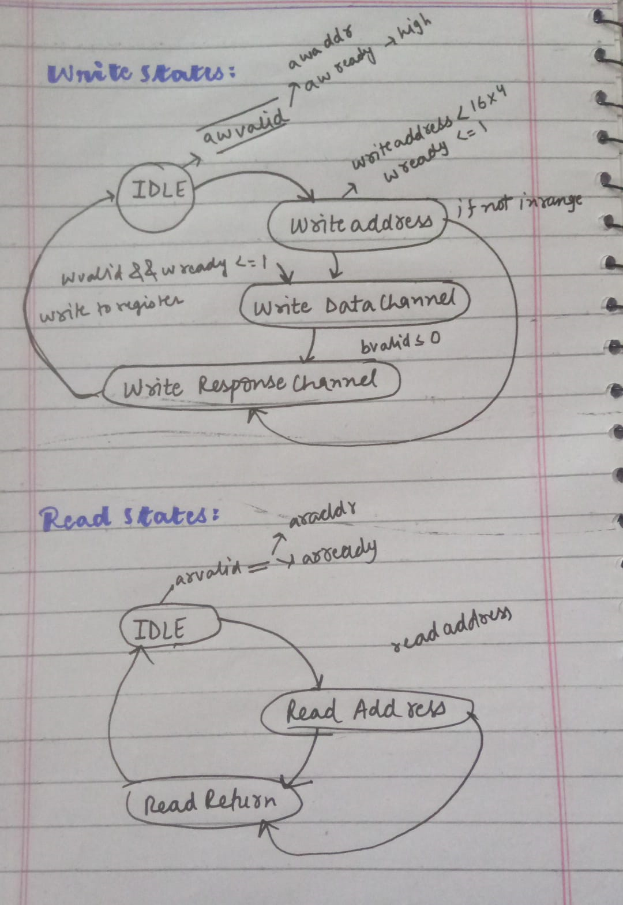

# AXI4-Lite Slave Testbench

This project implements and verifies an AXI4-Lite slave module using SystemVerilog.

## Introduction to AXI4-Lite

AXI4-Lite is a subset of the AXI4 protocol designed for simple register-style interfaces in low-bandwidth systems. It supports burst transactions but lacks some of the advanced features of the full AXI4 protocol, such as out-of-order transaction completion and data interleaving.

### AXI4-Lite Signals

- **Write Address (AW):**
  - `awaddr`: Address for write transaction.
  - `awprot`: Protection type for write transaction.
  - `awvalid`: Write address valid signal.
  - `awready`: Write address ready signal.

- **Write Data (W):**
  - `wdata`: Data to be written.
  - `wstrb`: Write strobes indicating byte enables.
  - `wvalid`: Write data valid signal.
  - `wready`: Write data ready signal.

- **Write Response (B):**
  - `bresp`: Write response indicating completion status.
  - `bvalid`: Write response valid signal.
  - `bready`: Write response ready signal.

- **Read Address (AR):**
  - `araddr`: Address for read transaction.
  - `arprot`: Protection type for read transaction.
  - `arvalid`: Read address valid signal.
  - `arready`: Read address ready signal.

- **Read Data (R):**
  - `rdata`: Data read from the specified address.
  - `rresp`: Read response indicating completion status.
  - `rvalid`: Read data valid signal.
  - `rready`: Read data ready signal.

## Getting Started

These instructions will help you set up the project, simulate the AXI4-Lite slave module in Vivado, and understand the testbench.

### Prerequisites

Ensure you have the following installed:
- Vivado Design Suite

### Simulation Steps in Vivado

1. **Open Vivado:**
   - Launch Vivado Design Suite from your installed applications.

2. **Create a New Project:**

   - Click on `Create New Project`.
   - Follow the wizard to create an RTL project. Do not specify sources at this point.

3. **Add Sources:**

   - Go to `File -> Add Sources`.
   - Select `Add or Create Simulation Sources`.
   - Add `src/tb_AXI4_lite.v` and `src/AXI4_Lite_Slave_Address.v`.

4. **Set the Top Module:**

   - In the `Sources` window, right-click on `tb_AXI4_lite` and select `Set as Top`.

5. **Run Simulation:**

   - Go to the `Flow Navigator` pane.
   - Click on `Run Simulation` and then `Run Behavioral Simulation`.

### Testbench Overview

The testbench (`tb_AXI4_lite.v`) includes the following test cases:
1. Write transaction to a valid address.
2. Read transaction from a valid address.
3. Write transaction to an invalid address.
4. Read transaction from an invalid address.

Each test case verifies the correct operation and response of the AXI4-Lite slave module.

## Diagram

