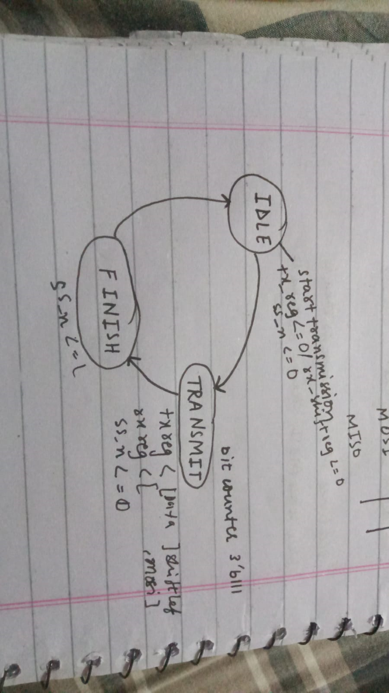

# SPI Master Verilog Module

## Overview

This repository contains a Verilog module for an SPI Master along with its testbench.

### SPI Master

#### Parameters

- **DATA_WIDTH**: Default is 8 bits. Specifies the width of the data being transmitted/received.

#### Ports

**Global Signals:**
- `clk`: Clock signal.
- `rst_n`: Active-low reset signal.

**Control Signals:**
- `start_transaction`: Starts the SPI transaction.
- `tx_data`: Data to be transmitted.
- `rx_data`: Received data.
- `transaction_done`: Indicates that the transaction is complete.

**SPI Interface:**
- `sclk`: SPI clock signal.
- `mosi`: Master Out Slave In signal.
- `miso`: Master In Slave Out signal.
- `ss_n`: Slave select signal.

#### Functionality

The SPI Master operates in three states: IDLE, TRANSMIT, and FINISH.
- Data transmission/reception is handled using shift registers.
- Generates an SPI clock with the desired frequency using the CLOCK_DIVIDER parameter.

#### State Machine

The SPI Master module employs a simple state machine:

- **IDLE State**: Waits for `start_transaction` signal. On detection, transitions to **TRANSMIT** state.
- **TRANSMIT State**: Shifts out `tx_data` on `mosi` and shifts in data on `miso`. Transitions to **FINISH** state upon completion of data transfer.
- **FINISH State**: Sets `transaction_done` to indicate completion and returns to **IDLE** state.

### Testbench Overview

#### Prerequisites

Ensure you have the following installed:
- Vivado Design Suite

#### Simulation Steps in Vivado

1. **Open Vivado:**
   - Launch Vivado Design Suite from your installed applications.

2. **Create a New Project:**

   - Click on `Create New Project`.
   - Follow the wizard to create an RTL project. Do not specify sources at this point.

3. **Add Sources:**

   - Go to `File -> Add Sources`.
   - Select `Add or Create Simulation Sources`.
   - Add `src/spi_master_tb.v` and `src/spi_master.v`.

4. **Set the Top Module:**

   - In the `Sources` window, right-click on `spi_master_tb` and select `Set as Top`.

5. **Run Simulation:**

   - Go to the `Flow Navigator` pane.
   - Click on `Run Simulation` and then `Run Behavioral Simulation`.

### Diagram

This diagram shows the states:

